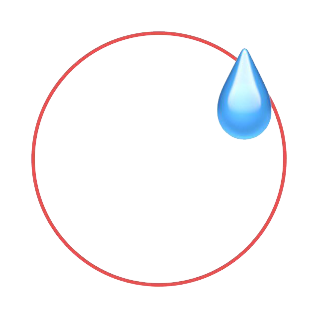

    

<h1> NoneBot 梗图收集 </h1>

* * *

### 介绍

~~NoneBot群的大佬们个个都是人才，说话又好听，我超喜翻在里面的♡~~

从群里收集而来的梗图，既有大佬们聊天梗，也有各种与NoneBot相关的奇奇怪怪梗图。

~~为了方便品鉴，~~ 便新建仓库存放了，欢迎使用哦√

### 投递新图

本仓库欢迎更多更新的梗图，如果你有相关新的梗图想要加入本仓库，只需要Fork后做一些简单更改即可√

当然，也欢迎加入NoneMeme团队更方便的进行更改~

> 1. Fork 本仓库
> 
> 2. 准备图片
>    
>    1. 内容应为**NoneBot相关的**梗图
>    
>    2. 将文件名字命名为你需要表述的意思
> 
> 3. 提交图片
>    
>    1. 将图片放入 meme 文件夹中
>    
>    2. 提交 PR

### 删除旧梗

本仓库虽用于记录NoneBot交流群所流传的相关梗图，但图中任何内容均不代表NoneBot团队的相关态度，也不会强迫任何群聊成员“入典”。

如有内容影响到NoneBot的正常开发，或被群聊成员公认不应“入典”，或其主人拒绝“入典”，可联系NoneMeme团队或提交pr进行删除。

### 感谢

本仓库借用了很多代码和灵感 ~~，甚至连Readme都有借用~~ ，感谢

**[modcrafts/a60-shop](https://github.com/modcrafts/a60-shop)** 本仓库几乎所有东西都借用于此 ~~，而且A60酱太可爱啦！！！~~ 

**[picocss/pico](https://github.com/picocss/pico/tree/f9e97c0bf430df8fa3f730eb6a6e84f63d4a9b0c)** 了解到了一个非常好用的CSS框架！
